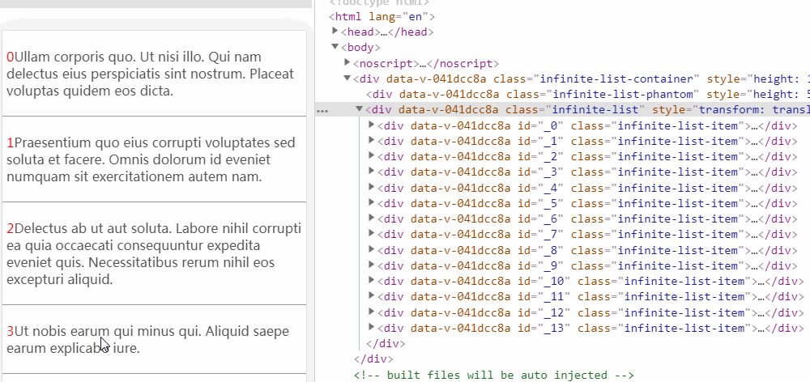
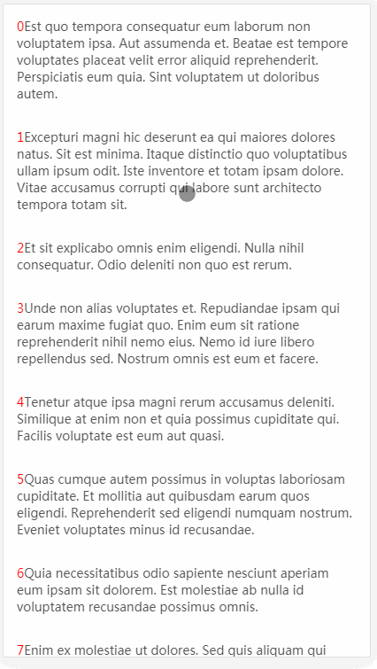

# vue-virtual-listview

一个基于Vue2.6+的虚拟列表组件，可同时加载大量数据，并支持动态高度。

>注意: 由于在 iOS UIWebviews 中，`scroll` 事件是在滚动停止之后触发的，所以不兼容iOS UIWebviews。[了解更多](https://developer.mozilla.org/en-US/docs/Web/Events/scroll#Browser_compatibility)

## 安装

通过 npm:

```shell
npm install vue-virtual-listview --save
```

## 基本使用

```html
<template>
    <VirtualList
        :list-data="data"
        :estimated-item-size="100"
        v-slot="slotProps"
    >
        <div class="context">
            {{ slotProps.item.value }}
        </div>
    </VirtualList>
</template>
```

```javascript
import VirtualList from 'vue-virtual-listview'

export default{
    data(){
        return [
            {
                value:'Est quo tempora consequatur......'
            },
            {
                value:'Excepturi magni hic deserunt......'
            }
            //.....
        ]
    },
    component:{
        VirtualList
    }
}

```



## 下拉刷新

```html
<template>
    <VirtualList
        ref="vlist"
        :list-data="data"
        :estimated-item-size="100"
        :top-load-more="true"
        :top-method="update"
        v-slot="slotProps"
    >
        <div class="context">
            {{ slotProps.item.value }}
        </div>
    </VirtualList>
</template>
```

```javascript
import VirtualList from 'vue-virtual-listview'

export default{
    data(){
        return [
            {
                value:'Est quo tempora consequatur......'
            },
            {
                value:'Excepturi magni hic deserunt......'
            }
            //.....
        ]
    },
    methods:{
        update(){
            let data = [
                {
                    value:'This is one demo~'
                },
                {
                    value:'This is tow demo~'
                }
                //.....
            ];
            this.data = data;
            this.$refs.vlist.onBottomLoaded();
        },
    },
    component:{
        VirtualList
    }
}

```



## 属性

|参数|类型|默认值|是否必填|说明|
|:--:|:--:|:--:|:--:|:--|
|listData|Array||✓|列表所需要的数据|
|height|String|100%||包裹元素的高度。|
|column|Number|1||列数|
|bufferScale|Number|1||在可见区域之外的上/下方预渲染比例，避免快速滑动时出现闪烁|
|estimatedItemSize|Number|150||列表项的预估高度，用于预先计算可视区域的显示项数|
|topLoadMore|Boolean|false||是否启用下拉刷新|
|topMethod|Function|||刷新时调用的回调函数|
|topDistance|Number|70||触发 topMethod 的下拉距离阈值（像素）|
|maxDistance|Number|0||组件可移动的最大距离（像素），若为 0 则不限制|
|distanceScale|Number|2||手指移动与组件移动距离的比值|
|topTextColor|String|#000000||刷新区域的文本颜色|
|topPullText|String|上拉刷新||刷新状态为pull时提示区的文字|
|topDropText|String|释放更新||刷新状态为drop时提示区的文字|
|topLoadingText|String|加载中...||刷新状态为loading时提示区的文字|

## 事件

|事件名称|回调参数|说明|
|:--:|:--:|:--:|
|top-status-change|顶部刷新区域状态变更时触发|提示区域状态|

## 提示区状态说明

|状态|说明|
|:--:|:--|
|pull|开始拖拽，距离未达到topDistance|
|drop|距离达到 topDistance 释放触发 topMethod|
|loading|已被释放，topMethod 已经执行|
|none|刷新完成或未触发刷新动作|

## 插槽

|名称|说明|插槽Prop|
|:--:|:--:|:--|
|default|默认插槽|item:列表项当前数据<br>row:当前项在整体中的行数<br>col:当前项在当前行中的列数|
|top|顶部提示区插槽|dargState:顶部刷新提示区的状态<br>dargDistance:顶部刷新提示区的距离|
